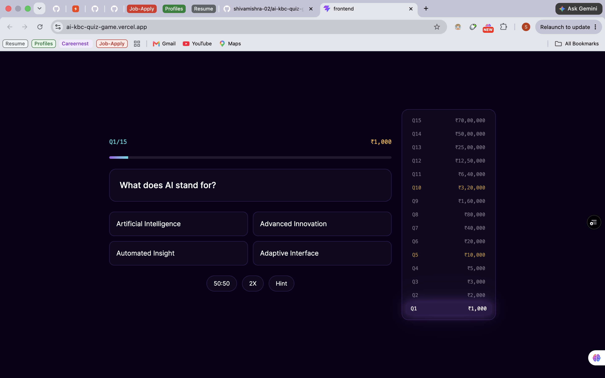

<div align="center">

# 🎯 AI KBC

### By:- Shivam Mishra

A premium, AI-powered "Kaun Banega Crorepati"-style quiz game. Questions on AI, machine learning, LLMs, and the latest tech — generated live by Groq's Llama models, with lifelines, locked milestones, and a real prize ladder.

[](https://react.dev)
[](https://vitejs.dev)
[](https://tailwindcss.com)
[](https://www.framer.com/motion/)
[](https://nodejs.org)
[](https://expressjs.com)
[](https://groq.com)
[](https://www.docker.com)

[](https://render.com)
[](https://vercel.com)
[](https://github.com/shivamishra-02/ai-kbc-quiz-game)

</div>

<br>

<div align="center">
  
</div>

<br>

## 🔗 Live Demo

| | |
|---|---|
| 🎮 **Play the game** | [https://ai-kbc-quiz-game.vercel.app](https://ai-kbc-quiz-game.vercel.app/) <!-- TODO: replace with your real Vercel URL --> |
| ⚙️ **Backend health check** | [https://ai-kbc-quiz-by-shivam-mishra.onrender.com/health](https://ai-kbc-quiz-by-shivam-mishra.onrender.com/health) |

> Note: the backend runs on Render's free tier, which spins down after 15 minutes of inactivity. If the game takes 30-60 seconds to start on first load, that's just the server waking up — it'll be fast after that.

<br>

## 📖 About

AI KBC is a full-stack quiz game inspired by the iconic prize-ladder, lifeline-driven format of game shows like *Kaun Banega Crorepati* and *Who Wants to Be a Millionaire* — rebuilt for the AI era. Instead of static trivia, every question is generated on the fly by an LLM and covers artificial intelligence, machine learning, generative AI, and current tech trends. If the AI ever fails to respond, a hardcoded question bank kicks in automatically — the game is designed to never break, no matter what the API does.

<br>

## ✨ Features

- **15 AI-generated questions** per game, covering AI fundamentals, ML, LLMs, generative AI, and recent tech trends, generated live via the Groq API (Llama 3.3 70B)
- **Automatic fallback system** — if Groq fails or returns invalid data, a curated bank of 15 hardcoded questions fills in seamlessly, question by question, so the game never crashes
- **3 classic lifelines**, each usable once per game:
  - **50:50** — removes two incorrect options
  - **2X** — gives a second attempt on the same question if the first answer is wrong
  - **Hint** — generates a clue via Groq that narrows things down without ever revealing the answer
- **KBC-style prize ladder** — 15 questions, prizes scaling from ₹1,000 up to ₹70,00,000
- **2 locked milestones** (Q5 and Q10) — once cleared, that amount is guaranteed even if a later question is answered wrong
- **Server-authoritative game state** — the correct answer and explanation are never sent to the client until a question is actually answered, so there's no way to peek via dev tools
- **Premium dark UI** — glassmorphism cards, neon gradient accents, an animated glowing prize ladder, confetti and a count-up score reveal on the winner screen
- **Fully responsive**, with reduced-motion support for accessibility

<br>

## 🛠️ Tech Stack

**Frontend**
- React + Vite
- Tailwind CSS v4
- Framer Motion (animations)
- Axios

**Backend**
- Node.js + Express.js
- Groq SDK (AI question + hint generation)
- Zod (request and AI-response validation)
- Helmet, Morgan, CORS

**AI**
- Groq API running Llama 3.3 70B (configurable via env var)

**Deployment**
- Docker (multi-stage builds for both frontend and backend)
- Render (backend web service)
- Vercel (frontend static deployment)

<br>

## 📁 Project Structure

```
ai-kbc-quiz-game/
├── backend/
│   ├── src/
│   │   ├── config/          # Environment validation (zod)
│   │   ├── routes/          # Express route definitions
│   │   ├── controllers/     # Request/response handling
│   │   ├── services/        # groqService, gameEngine, sessionStore
│   │   ├── middleware/      # Error handling, request validation
│   │   ├── data/             # Hardcoded fallback question bank
│   │   └── utils/            # Prize ladder, shared schemas
│   ├── Dockerfile
│   └── package.json
├── frontend/
│   ├── src/
│   │   ├── components/       # Credit, PrizeLadder
│   │   ├── screens/          # StartScreen, QuizScreen, WinnerScreen
│   │   ├── hooks/            # useGame - all game state and API calls
│   │   ├── services/         # api.js - backend client
│   │   └── utils/            # Frontend copy of the prize ladder (display only)
│   ├── Dockerfile
│   ├── nginx.conf
│   └── package.json
├── docker-compose.yml
└── README.md
```

<br>

## 🚀 Getting Started

### Prerequisites
- Node.js 20+
- A free [Groq API key](https://console.groq.com)
- Docker (optional, only needed for the containerized setup)

### 1. Clone the repo
```bash
git clone https://github.com/shivamishra-02/ai-kbc-quiz-game.git
cd ai-kbc-quiz-game
```

### 2. Backend setup
```bash
cd backend
npm install
cp .env.example .env
# open .env and add your real GROQ_API_KEY
npm run dev
```
Backend runs at `http://localhost:5000`.

### 3. Frontend setup
```bash
cd frontend
npm install
cp .env.example .env
npm run dev
```
Frontend runs at `http://localhost:5173`.

### Environment Variables

**`backend/.env`**

| Variable | Description | Example |
|---|---|---|
| `PORT` | Port the server listens on | `5000` |
| `NODE_ENV` | Environment mode | `development` |
| `GROQ_API_KEY` | Your Groq API key | `gsk_...` |
| `GROQ_MODEL` | Groq model to use | `llama-3.3-70b-versatile` |
| `FRONTEND_URL` | Allowed CORS origin | `http://localhost:5173` |

**`frontend/.env`**

| Variable | Description | Example |
|---|---|---|
| `VITE_API_BASE_URL` | Backend API base URL | `http://localhost:5000` |

<br>

## 🔌 API Reference

All endpoints except `/start` require an `x-session-id` header, returned when the game starts.

| Method | Endpoint | Description |
|---|---|---|
| `POST` | `/api/game/start` | Starts a new game and generates 15 questions |
| `GET` | `/api/game/question` | Fetches the current question (sanitized — no answer included) |
| `POST` | `/api/game/answer` | Submits an answer (`{ selectedOption }`) |
| `POST` | `/api/game/lifeline` | Uses a lifeline (`{ type: "fiftyFifty" \| "twoX" \| "hint" }`) |

<br>

## 🐳 Running with Docker

```bash
docker compose up --build
```
This builds and runs both the backend and frontend in containers, wired together exactly as in local dev. Frontend will be available at `http://localhost:5173`.

<br>

## ☁️ Deployment

- **Backend** is deployed on [Render](https://render.com) as a Docker-based web service (free tier)
- **Frontend** is deployed on [Vercel](https://vercel.com), built natively from the Vite project (no Docker needed there)

<br>

## 🗺️ Roadmap

- [ ] Server-side timer enforcement per question
- [ ] Persistent leaderboard (MongoDB)
- [ ] Wire up real sound effects (placeholders currently in the UI)
- [ ] Full prize ladder visible on mobile (currently desktop/tablet only)

<br>

## 👤 Author

**Shivam Mishra**

[](https://github.com/shivamishra-02)
[](https://www.linkedin.com/in/shivam-mishra-3a741b253/)

<br>

## 📄 License

No license file is included yet. Add one (MIT is a common, permissive choice for portfolio projects) if you want others to be able to freely use or build on this code.